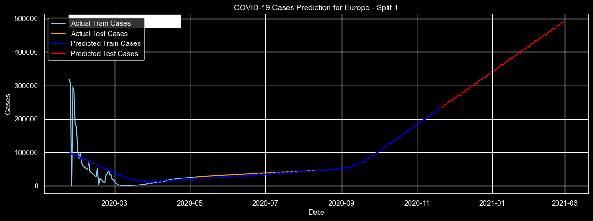

[)](https://git.io/typing-svg)

# Introduction
🌍 Navigating the Pandemic: Insights from Global Data 📉 This project delves into the intricacies of the COVID-19 pandemic, unraveling the threads of 🦠 infection rates, mortality, and public health responses across the globe. Through a lens focused on 🧪 testing, 📊 case counts, and 💔 death tolls, alongside demographic and healthcare capacity markers, we uncover patterns and correlations that shed light on the pandemic's impact. From the role of 🏥 healthcare infrastructure to demographic vulnerabilities and the critical importance of 🧬 testing, this analysis offers a comprehensive view of how countries have navigated the challenges posed by this unprecedented global health crisis.

🔍Looking for Python scripts I Used? Check them out here: [NoteBook folder](/notebook/)

### Aim of the project :

1. What is the relation between the features and COVID-19 Cases & Deaths?
2. How have COVID-19 cases and deaths varied month by month across continents?
3. Why the Virus Spread was high in it's earliest stages?
4. What are the Top 10 Countries with the highest Cases & Deaths?
5. How do COVID-19 cases and deaths vary globally?
6. What is the Total number of Corona's Deaths & Cases?
7. Can we predict next month's COVID-19 Cases?

# The Analysis
Each visualization in this project is tailored to investigate specific aspects of the COVID-19 data. Here's my approach to addressing each question:

### 1. What is the relation between the features and COVID-19 Cases & Deaths ?


The correlation matrix visualizes the relationship between various variables in the dataset. Here's a breakdown of key insights:

#### Strong Correlations:
* __Cases and Deaths (0.86)__: This strong positive correlation indicates that as the number of COVID-19 cases increases, the number of deaths tends to increase as well, which is expected given the nature of the pandemic.

* __Daily Tests and Cases (0.80), Daily Tests and Deaths (0.75)__: These strong positive correlations suggest that regions with more extensive testing report higher numbers of cases and deaths. This may reflect both the spread of the virus and the level of response in terms of testing capacity.

* __Median Age and Population Aged 65 and Over (0.91)__: A strong positive correlation shows that countries with a higher median age typically have a larger percentage of the population aged 65 and over. This relationship underscores demographic patterns related to aging populations.

#### Moderate to Weak Correlations:
* __GDP/Capita and Healthcare Resources__: Moderate positive correlations with hospital beds (0.38) and medical doctors (0.43) per 1000 people suggest that wealthier countries tend to have better healthcare resources. However, the correlation isn't extremely strong, indicating other factors also play significant roles.

* __Population and COVID-19 Metrics__: The population shows moderate positive correlations with Daily Tests (0.50), Cases (0.42), and Deaths (0.38). This indicates that larger populations tend to have higher absolute numbers of tests, cases, and deaths, but the relationship isn't perfectly linear, suggesting effective response measures can mitigate impacts regardless of population size

### 2.1. How have COVID-19 cases and deaths varied month by month across continents?

__NOTE:__
* 1e7: represents 10,000,000 (10 million).
* 1e8: represents 100,000,000 (100 million).
* 1e9: represents 1,000,000,000 (1 billion).

### 2.2. Monthly Cases and Deaths Globally


### 3. Why the Virus Spread was high in it's earliest stages?
#### __Understanding the peak that occurred between 2020-02 & 2020-04__


#### ___Analysis___
* __Global Awareness__: March 2020 is when many governments and populations began to realize the severity of the pandemic, leading to lockdowns and emergency health measures.

* __Lag Effect__: There's typically a lag between case detection, hospitalizations, and deaths, which means the actions (or inactions) in early 2020 began to show their consequences around this time.

* __Rapid Spread__: In the early stages of the pandemic COVID-19 was spreading rapidly across continents, leading to increased fatalities.

___Validating this analysis by external sources:___

[Source 1](https://www.who.int/data/stories/the-true-death-toll-of-covid-19-estimating-global-excess-mortality)

[Source 2](https://en.wikipedia.org/wiki/Timeline_of_the_COVID-19_pandemic_in_March_2020)

[Source 3](https://ourworldindata.org/covid-deaths)

### 4. What are the Top 10 Countries with the highest Cases & Deaths?

**Note** : _(The bar chart represents total cases, while the line chart with markers indicates total deaths for these countries)_

#### _**Key Insights**_:
* **Correlation Between Cases and Deaths**: There's a clear visual correlation between the number of reported cases and deaths across these countries. Higher case counts generally correlate with higher death tolls, underscoring the deadly nature of the virus, especially in contexts with overwhelmed healthcare systems or high-risk populations.

* **Variation in Death Rates**: While all top countries have high case numbers, there's noticeable variation in the death rates. Some countries have higher deaths relative to their case counts, which could point to varying levels of healthcare capacity, differences in population demographics, or the effectiveness of the countries' response strategies.

* **Response Measures**: Indirectly, the plot also offers insights into the effectiveness of different countries' response measures. Countries with lower death rates despite high case counts may have had more effective healthcare responses or mitigation strategies.

### 5. How do COVID-19 cases and deaths vary globally?


 __Note :__ _(The red dots indicate the number of deaths and cases that occurred in each country. They don't indicate the area or zone of spreading)_

__🧐 Want to interact with the maps and see the trend of Cases and Deaths per time? Check them out here:__

[COVID-19 Cases Trend Map](https://public.tableau.com/views/COVID-19CasesDeaths_17126681811150/Sheet1?:language=en-GB&:sid=&:display_count=n&:origin=viz_share_link)

[COVID-19 Deaths Trend Map](https://public.tableau.com/views/COVID-19CasesDeaths_17126681811150/Sheet2?:language=en-GB&:sid=&:display_count=n&:origin=viz_share_link)

### 6. What is the Total number of Corona's Deaths & Cases

#### Total Cases

| Continent     | Deaths      |
|---------------|-------------|
| Africa        | 15,524,181  |
| Asia          | 99,912,029.5|
| Europe        | 74,671,176  |
| North America | 107,315,770.5|
| Oceania       | 457,566.5   |
| South America | 35,201,964  |


#### Total Deaths

| Continent     | Cases         |
|---------------|---------------|
| Africa        | 420,655,500   |
| Asia          | 3,723,511,000 |
| Europe        | 2,175,135,000 |
| North America | 3,719,593,000 |
| Oceania       | 7,884,048     |
| South America | 981,779,800   |


### 7. Can we predict next month's COVID-19 Cases?

To forecast next month's COVID-19 __Cases__, we've chosen the __Prophet__ model by Facebook, known for handling time series data effectively.

* ### __Step 1:__ Isolating Countries by Continent:

For this task we devided our dataframe to seperate d.fs where each d.f represent a continent (e.g. df_europe = dataframe of europe). the following python script highlights the proccess

```python
# We splitted separate dataframes for each continent
df_continents = {continent: df[df['Continent'] == continent] for continent in df['Continent'].unique()}

# Aggregating dataframe for each continent by date as index, including the mean
df_aggregated = {continent: df.groupby('Date').agg({
    'Cases': 'mean',
    'Deaths': 'mean',
    'Average temperature per year': 'mean',
    'Hospital beds per 1000 people': 'mean',
    'Medical doctors per 1000 people': 'mean',
    'GDP/Capita': 'mean',
    'Population': 'mean',
    'Median age': 'mean',
    'Population aged 65 and over (%)': 'mean'
}).reset_index() for continent, df in df_continents.items()}
for continent, df in df_aggregated.items():
    df_aggregated[continent] = df.set_index('Date')
```

Assigning the aggregated dataframe for each continent:
```python
df_europe = df_aggregated['Europe']
df_asia = df_aggregated['Asia']
df_north_america = df_aggregated['North America']
```
* ### __Step2:__ Model Training 

```python
from prophet import Prophet
from sklearn.metrics import mean_absolute_error, r2_score, mean_squared_error
from sklearn.model_selection import TimeSeriesSplit

def predict_cases_continents(df_dict, n_splits=3):
    predictions = {}
    scores_train = {}
    scores_test = {}
    tscv = TimeSeriesSplit(n_splits=n_splits)

    for continent, df in df_dict.items():
        df_prophet = df.reset_index().rename(columns={'Date': 'ds', 'Cases': 'y'})
        df_prophet['ds'] = pd.to_datetime(df_prophet['ds'])
        scores_train[continent] = []
        scores_test[continent] = []

        for train_idx, test_idx in tscv.split(df_prophet):
            train = df_prophet.iloc[train_idx]
            test = df_prophet.iloc[test_idx]
            
            # Train the model
            model = Prophet(daily_seasonality='auto', yearly_seasonality='auto', weekly_seasonality='auto')
            model.fit(train)

            # Make predictions on the training set
            forecast_train = model.predict(train[['ds']])
            
            # Make predictions on the test set
            forecast_test = model.predict(test[['ds']])
            
            # Store predictions
            predictions[continent] = {
                'train': forecast_train,
                'test': forecast_test
            }

            # Calculate scores for train set
            y_true_train = train['y']
            y_pred_train = forecast_train['yhat']
            scores_train[continent].append({
                'R2 Score': r2_score(y_true_train, y_pred_train),
                'MSE': mean_squared_error(y_true_train, y_pred_train),
                'MAE': mean_absolute_error(y_true_train, y_pred_train)
            })

            # Calculate scores for test set
            y_true_test = test['y']
            y_pred_test = forecast_test['yhat']
            scores_test[continent].append({
                'R2 Score': r2_score(y_true_test, y_pred_test),
                'MSE': mean_squared_error(y_true_test, y_pred_test),
                'MAE': mean_absolute_error(y_true_test, y_pred_test)
            })

    return predictions, scores_train, scores_test

# dictionary of continent dataframes we created before
df_continents = {
    'Europe': df_europe,
    'North America': df_north_america,
    'Asia': df_asia,
}

# displaying the predictions for all continents and evaluation scores
continent_predictions, evaluation_scores_train, evaluation_scores_test = predict_cases_continents(df_continents)

continent_predictions, evaluation_scores_train, evaluation_scores_test
```
#### ___Keys dictionary:___

* __trend:__ The underlying trend of the time series data, which is the model's long-term progression.

* __yhat_lower and yhat_upper:__ These are the lower and upper bounds of the forecast's confidence interval. They represent the range within which the actual value is expected to fall, with a certain level of confidence (typically 95%).

* __trend_lower and trend_upper:__ Similar to yhat_lower and yhat_upper, but specifically for the trend component of the model. They provide the confidence interval for the trend estimate.

* __additive_terms:__ Components of the model that are added together to make the final prediction. This could include weekly, yearly, or daily seasonality, as well as holiday effects, depending on the model configuration.

* __additive_terms_lower and additive_terms_upper:__ The lower and upper bounds of the confidence interval for the additive terms.

* __weekly, weekly_lower, weekly_upper:__ The weekly seasonality effect estimated by the model. The "_lower" and "_upper" refer to the lower and upper bounds of the confidence interval for the weekly component.

* __multiplicative_terms:__ Components that are multiplied by the trend to make the final prediction. This is used when the effect of seasonality grows or shrinks in proportion to the trend.

* __multiplicative_terms_lower and multiplicative_terms_upper:__ The confidence intervals for the multiplicative terms.

* __yhat:__ The final forecasted value. It's the sum of the trend, seasonality, and any other factors the model includes.


 __yhat__ is the final prediction, while __trend__ is just one component of that prediction.
### ___Statistical Insights___

```python
# predictions for the beginning and end of March for each continent
europe_begin_march = 231834.836757  # yhat at the start of March for Europe
europe_end_march = 234421.820829  # yhat at the end of March for Europe

north_america_begin_march = 1060856  # yhat at the start of March for North America
north_america_end_march = 1087474  # yhat at the end of March for North America

asia_begin_march = 589849.874801  # yhat at the start of March for Asia
asia_end_march = 1009208  # yhat at the end of March for Asia

# Calculate the percentage increase for each continent
europe_increase = ((europe_end_march - europe_begin_march) / europe_begin_march) * 100
north_america_increase = ((north_america_end_march - north_america_begin_march) / north_america_begin_march) * 100
asia_increase = ((asia_end_march - asia_begin_march) / asia_begin_march) * 100

europe_increase, north_america_increase, asia_increase
```
* __Europe's Cases:__ An increase of approximately __1.12%__
* __North America's Cases:__ An increase of approximately __2.51%__
* __Asia's Cases:__ A significant increase of approximately __71.10%__

## Visualizing the Predictions and the Model's Performance:

* __Europe__



* __North America__


* __Asia__


__Note__ : 1e6 means 1 million // 10 to the power of 6 (1,000,000)


## ___Key Insights___

__Europe:__

* The predictions follow the actual trend closely in both training and testing phases for all splits.

__North America:__

* There's a noticeable overestimation during the early pandemic months, but the model adjusts and aligns closely with the actual cases in subsequent months.

__Asia:__

* For all splits, the test predictions maintain a consistent trend, indicating the model's stability across different time frames.


## __Conclusion__
The predictions indicate that the number of COVID-19 cases increased in each continent during March, suggesting that the virus continued to spread without showing signs of decrease across these regions.


# Summary
On this journey through data, I really leveled up my skills, mixing together a bunch of advanced tools to look into COVID-19 data and guess what might happen next:

* __🔍 Digging into Data (EDA):__ I got my hands dirty with the COVID-19 numbers, using charts and quick checks to spot patterns and weird stuff that stood out.

* __🤖 Implementing Machine Learning:__ Used a smart forecasting model called Prophet to make guesses on how COVID-19 cases might change, making sure to include things like trends and season changes in our guesses.

* __📊 Statistical Analysis for Validation:__ Employed statistical methods to ensure the reliability of our forecasts, utilizing metrics like percentage changes and confidence intervals to quantify the precision of our predictions.


Utilizing Python for coding and Tableau for visualizing, this COVID-19 project has enriched my understanding of data analysis. From interpreting figures to crafting informative visualizations, we've uncovered vital insights into the pandemic's impact.🧬
